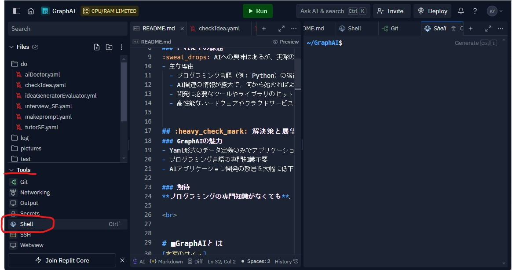
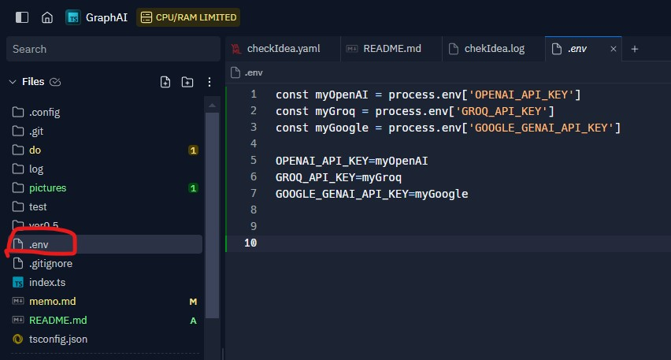
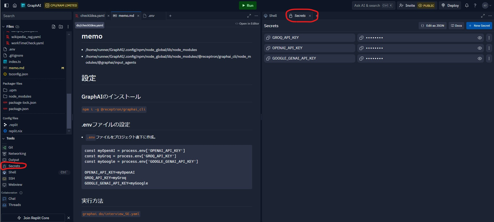

# ■私がやりたいこと
## :heavy_check_mark: 目標と課題
### 目標
- AIを使用した簡易アプリケーションの開発
  - AIとの対話による相談機能
  - アイデア創出と議論機能

### これまでの課題
:sweat_drops: AIへの興味はあるが、実際の開発に踏み出せず
- 主な理由
  - プログラミング言語（例: Python）の習得が難しいと感じる
  - AI関連の情報が膨大で、何から始めればよいか分からない
  - 開発に必要なツールやライブラリのセットアップが複雑で面倒
  - 高性能なハードウェアやクラウドサービスの使用料が高額


## :heavy_check_mark: 解決策と展望
### GraphAIの魅力
- Yaml形式のデータ定義のみでアプリケーション開発が可能
- プログラミング言語の専門知識不要
- AIアプリケーション開発の敷居を大幅に低下

### 期待
**プログラミングの専門知識がなくても**、AIを活用したアプリケーション開発に取り組むことができる。

<br>


# ■GraphAIとは
[本家のサイト]

　https://github.com/receptron/graphai

> GraphAIは、非同期データフロー実行エンジンで、開発者がYAMLやJSONで宣言的にデータフローグラフを記述することで、エージェントワークフローを構築できるツールです。複数のLLM（大規模言語モデル）呼び出しや非同期API呼び出しを管理し、より高品質な出力を段階的に生成するアプリケーションの開発を可能にします。<br><br>
GraphAIは、複雑な非同期処理や依存関係管理、並行実行、エラー処理などを自動的に処理します。開発者は、データの流れやエージェント間の依存関係をグラフ形式で記述するだけで、複雑な非同期プログラミングの課題を解決できます。<br><br>
このツールは、LLM呼び出し、データベースアクセス、Web検索など、さまざまな非同期操作を統合し、効率的なワークフローを作成するのに適しています。また、ネストされたグラフ、ループ、マッピング、条件付きフローなど、高度な制御機能も提供しています。

<br>

# ■さぁ開発だ！
## Replitの導入
GraphAIを動かすにはNode.jsが動く環境が必要です。WindowsでもLinuxでも構築できます。<br>
しかし環境の問題や各種設定など面倒なので、今回はReplitを使ってアプリケーションの開発を行います。

Replitは、インターネット上で使えるプログラム作成ツールです。<br>
特別なソフトをインストールしなくても、ブラウザさえあればすぐにプログラミングを始められます。<br>

:heart_eyes:Replitは「手軽にプログラミングを試せる便利な道具」です!

| 主なポイント         | 説明                                                                 |
|----------------------|----------------------------------------------------------------------|
| 簡単に始められる     | サインアップしてオンラインでプログラミングを始めるだけです。           |
| いろんな言語が使える | PythonやJavaScriptなど、人気のある言語がたくさん使えます。            |
| どこでも作業可能     | インターネットがあれば、どのパソコンからでもアクセスできます。         |
| 友達と一緒に作業     | 他の人と同時にコードを書いたり、相談しながら進められます。             |


## 無料アカウントを作成
https://replit.com/login

## プロジェクトの作成
Create a Repl から `TypeScript` を選択。<br>

<br>

# ■GraphAIのインストールと実行

## 1. GraphAIのインストール
右下ウィンドウのTools＞Shell（Ctrl+@） を起動して<br>



以下のコマンドを実行するだけ
```
npm i -g  @receptron/graphai_cli
```

## 2. LLMのAPIキーを取得する
各LLM（OpenAIとかGroqとか）のAPIキーを設定する。<br>
OpenAIとGroqの２つのAPIがあればよい。<br>
取得方法はGoogleで「OpenAI API取得方法」などで検索。<br>

　＜参考＞<br>
　　https://www.scuti.jp/blog/try-llama3-in-groqs-ultra-fast-environment#:~:text=GroqのAPI%20Key取得,キーを発行できます。


## 3. `.env`ファイルの設定

### :heavy_check_mark: `.env`ファイルをプロジェクト直下に作成。ファイルの中身は以下の通り。
 
 
 ```
const myOpenAI = process.env['OPENAI_API_KEY']
const myGroq = process.env['GROQ_API_KEY']
const myGoogle = process.env['GOOGLE_GENAI_API_KEY']

OPENAI_API_KEY=myOpenAI
GROQ_API_KEY=myGroq
GOOGLE_GENAI_API_KEY=myGoogle
 ```
### :heavy_check_mark: LLMのAPIキーは「Secrets」 に登録する

Replitは無料利用の場合、作成したソースは公開されてしまう（Private設定できない）。<br>
そのためAPIキーはSecretsに登録する必要がある。<br>

:+1:ウィンドウ右下の Tools＞Secrets<br>


## 4. 実行方法
interview_SE.yaml を実行する場合は以下のコマンド実施。<br>
ソース修正後、都度以下コマンドを実行すれば動作する（コンパイルなどは不要）

```
graphai do/interview_SE.yaml
```

## 5. ログ
以下のコマンドでログの出力が可能。<br>
:warning:大量のログが出ます。
```
graphai do/interview_SE.yaml -log log/interview_SE.log
```
<br>

# LLM利用料金
ここ最近、価格が安く高性能なLLMモデルが出てきている。<br>
LLMの利用において価格を気にする必要がないため、今後は利用幅が格段に広がっていくものと考える。<br>


| 会社 | モデル | 入力 (1M トークン約200万字) | 出力 (1M トークン約200万字) |
|------|--------|---------------------------|---------------------------|
| OpenAI | GPT-4o | $5.00 (¥775) | $15.00 (¥2,325) |
| OpenAI | GPT-4o mini | $0.15 (¥23.25) | $0.60 (¥93) |
| OpenAI | GPT-4 Turbo | $10.00 (¥1,550) | $30.00 (¥4,650) |
| OpenAI | GPT-4 | $30.00 (¥4,650) | $60.00 (¥9,300) |
| OpenAI | GPT-3.5 Turbo | $0.50 (¥77.50) | $1.50 (¥232.50) |
| groq | Llama3-70b-8192 | 無料 | 無料 |