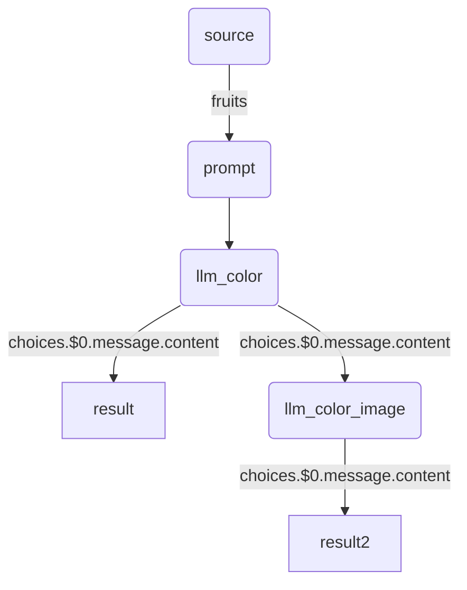

# ■私がやりたいこと
## :heavy_check_mark: 目標と課題
### 目標
- AIを使用した簡易アプリケーションの開発
  - AIとの対話による相談機能
  - アイデア創出と議論機能

　　[サンプル](Sample.md)


### これまでの課題
:sweat_drops: AIへの興味はあるが、実際の開発に踏み出せず
- 主な理由
  - プログラミング言語（例: Python）の習得が難しいと感じる
  - 各種処理を同期・非同期などを考慮して実装するのが大変そう
  - AI関連の情報が膨大で、何から始めればよいか分からない
  - 開発に必要なツールやライブラリのセットアップが複雑で面倒
  - 高性能なハードウェアやクラウドサービスの使用料が高額


## :heavy_check_mark: 解決策と展望
### GraphAIの魅力
- Yaml形式のデータ定義のみでアプリケーション開発が可能
- 複数の同期・非同期APIコールの管理における複雑さを軽減
- プログラミング言語の専門知識不要


### 期待
**プログラミングの専門知識がなくても**、AIを活用したアプリケーション開発に取り組むことができる。

<br>


# ■GraphAIとは
[本家のサイト]　https://github.com/receptron/graphai<br>
[紹介サイト]　https://zenn.dev/singularity/articles/graphai-about<br>
[Youtube]　https://www.youtube.com/watch?v=0mh_Nu9SefQ

> GraphAIは、非同期データフロー実行エンジンであり、プログラミングの専門知識がない方 でも簡単にAIアプリケーションを作成できるオープンソースのツールです。<br><br>
多くの人がAIを活用したいと思っても、プログラミングの壁に直面し、諦めてしまうことが多いです。しかし、GraphAIを使えば、その壁を越えることができます。データフローをYAMLやJSONで宣言的に記述することで、視覚的に理解しやすく、誰でも扱いやすい設計になっています。<br><br>
例えば、果物の色を取得し、それを基に特定の質問に対する回答を生成するアプリケーションを考えてみましょう。
このプロセスでは、データを取得し、解析し、最終的な回答を生成する一連のステップがありますが、GraphAIがこのすべてを自動的に管理し、実行してくれます。<br><br>
さらに、GraphAIは複数のAPI呼び出しを同時に行えるため、パフォーマンスが向上し、迅速に高品質な出力を得ることができます。エラー処理やリトライの管理もGraphAIが行うため、開発者はビジネスロジックに集中できます。
GraphAIを使うことで、複雑なデータ依存性の管理が容易になり、従来のプログラミングスタイルでは難しかった並行プログラミングをシンプルに実現します。これにより、開発者はより効率的に、柔軟にアプリケーションを構築できるようになります。

## 例）りんごの色と、その色に対する見解を述べる
```yaml
version: 0.5
nodes:
  source:
    value:
      fruits: "りんご"
  # 質問文生成
  prompt:
    agent: stringTemplateAgent
    params:
      template: 
        "${0} は一般的に何色ですか？ 色だけを回答してください。回答例）XX色"
    inputs: 
      - ":source.fruits"
    isResult: true
  # AIに確認
  llm_color:
    agent: openAIAgent
    params:
      model: gpt-4o-mini
    inputs:
      prompt: :prompt
  # 最初の質問に対する結果を返す
  result:
    agent: copyAgent
    isResult: true
    inputs:
      - ":llm_color.choices.$0.message.content"
  # 先ほどの結果をうけた次の質問をAIに確認
  llm_color_image:
    agent: openAIAgent
    params:
      model: gpt-4o-mini
      query: 
        "連想することは何ですか？日本語で50字以内で回答して。"
    inputs:
      prompt: ":llm_color.choices.$0.message.content"
  # 最終的な結果表示
  result2:
    agent: copyAgent
    isResult: true
    inputs:
      - ":llm_color_image.choices.$0.message.content"
```
### 結果
```shll
~/GraphAI$ graphai working/color.yaml 
{
  "prompt": "りんご は一般的に何色ですか？ 色だけを回答してください。 回答例）XX色",
  "result": "赤色",
  "result2": "赤色（あかいろ）は、色の一つで、光のスペクトルでは波長が約620〜750ナノメートルの範囲にある色です。
  　　赤色は情熱や愛、エネルギー、警告などの象徴とされることが多く、さまざまな文化や状況で特別な意味を持つことがあります。
  　　例えば、赤色は中国文化では幸福や繁栄を象徴し、クリスマスやバレンタインデーなどの特別なイベントでもよく使われます。
  　　また、赤色は視認性が高いため、交通信号や標識にも頻繁に用いられています。
  　　何か具体的なことについてお話ししたいことがあれば教えてください！"
}
```



<br>

# ■早速開発！
## Replitの導入
GraphAIを動かすにはNode.jsが動く環境が必要です。WindowsでもLinuxでも構築できます。<br>
しかし環境の問題や各種設定など面倒なので、今回はReplitを使ってアプリケーションの開発を行います。

Replitは、インターネット上で使えるプログラム作成ツールです。<br>
特別なソフトをインストールしなくても、ブラウザさえあればすぐにプログラミングを始められます。<br>

:heart_eyes:Replitは「手軽にプログラミングを試せる便利な道具」です!

| 主なポイント         | 説明                                                                 |
|----------------------|----------------------------------------------------------------------|
| 簡単に始められる     | サインアップしてオンラインでプログラミングを始めるだけです。           |
| いろんな言語が使える | PythonやJavaScriptなど、人気のある言語がたくさん使えます。            |
| どこでも作業可能     | インターネットがあれば、どのパソコンからでもアクセスできます。         |
| 友達と一緒に作業     | 他の人と同時にコードを書いたり、相談しながら進められます。             |


## 無料アカウントを作成
https://replit.com/login

## プロジェクトの作成
Create a Repl から `TypeScript` を選択。<br>

<br>

# ■GraphAIのインストールと実行

## 1. GraphAIのインストール
右下ウィンドウの　Tools＞Shell　を起動して<br>


以下のコマンドを実行する。

```shell
npm i -g  @receptron/graphai_cli
```

インストール後、`graphai` を実行し結果が出ればインストールOK。
```
~/GraphAI$ graphai 
graphai <yaml_or_json_file>

run GraphAI with GraphAI file.

Positionals:
  yaml_or_json_file  yaml or json file                                  [string]
  ：
```


## 2. LLMのAPIキーを取得する
各LLM（OpenAIとかGroqとか）のAPIキーを設定する。<br>
OpenAIとGroqの２つのAPIがあればよい。<br>
取得方法はGoogleで「OpenAI API取得方法」などで検索。<br>

＜参考＞<br>
https://www.scuti.jp/blog/try-llama3-in-groqs-ultra-fast-environment#:~:text=GroqのAPI%20Key取得,キーを発行できます。


## 3. `.env`ファイルの設定

### :heavy_check_mark: `.env`ファイルをプロジェクト直下に作成。ファイルの中身は以下の通り。
 
 
 ```shell
const myOpenAI = process.env['OPENAI_API_KEY']
const myGroq = process.env['GROQ_API_KEY']
const myGoogle = process.env['GOOGLE_GENAI_API_KEY']

OPENAI_API_KEY=myOpenAI
GROQ_API_KEY=myGroq
GOOGLE_GENAI_API_KEY=myGoogle
 ```
### :heavy_check_mark: LLMのAPIキーは「Secrets」 に登録する

Replitは　`無料利用の場合、作成したソースは公開されてしまう`（Private設定できない）。<br>
そのため、APIキーは「Secrets」に登録する必要がある。<br>

:+1:ウィンドウ右下の Tools＞Secrets<br>


## 4. 実行方法
[interview_SE.yaml](src/interview_SE.yaml)　の中身をコピーして
各自の環境に作成。実行する場合は以下のコマンド実施。<br>
※srcフォルダ配下に作った場合<br>
ソース修正後、都度以下コマンドを実行すればすぐに動作する（コンパイルなどは不要）。

```shell
graphai src/interview_SE.yaml
```

## 5. ノウハウ
- shell（ターミナル）画面のコピーは　`CTL + SIHFT + C`。ペーストも `SHIFT`が必要！！
- 数万レベルの大量ログが出る場合はログ参照可能な状態になるのに時間がかかる。

## 6. ログ
以下のコマンドでログの出力が可能。<br>
:warning:大量のログが出ます。

```shell
graphai src/interview_SE.yaml --log log/interview_SE.log
```
<br>

# LLM利用料金
ここ最近、価格が安く高性能なLLMモデルが出てきている。<br>
LLMの利用において価格を気にする必要がないため、今後は利用幅が格段に広がっていくものと考える。<br>
:+1:私は無料の「Llama3-70b-8192」をベースに、性能を上げたい場合は「GPT-4o mini」を使うようにしています。

<br>

| 会社 | モデル | 入力 (1M トークン約200万字) | 出力 (1M トークン約200万字) |
|------|--------|---------------------------|---------------------------|
| OpenAI | GPT-4o | $5.00 (¥775) | $15.00 (¥2,325) |
| OpenAI | GPT-4o mini | $0.15 (¥23.25) | $0.60 (¥93) |
| OpenAI | GPT-4 Turbo | $10.00 (¥1,550) | $30.00 (¥4,650) |
| OpenAI | GPT-4 | $30.00 (¥4,650) | $60.00 (¥9,300) |
| OpenAI | GPT-3.5 Turbo | $0.50 (¥77.50) | $1.50 (¥232.50) |
| groq | Llama3-70b-8192 | 無料 | 無料 |

<br>

# 今後に向けて
今回GraphAIを使った各種アプリケーションをいくつか作成した。<br>
※srcフォルダ配下<br>

今後は作成したこれらのアプリケーションをWEB化し、多くの人が利用できるようにしていきたい。<br>
